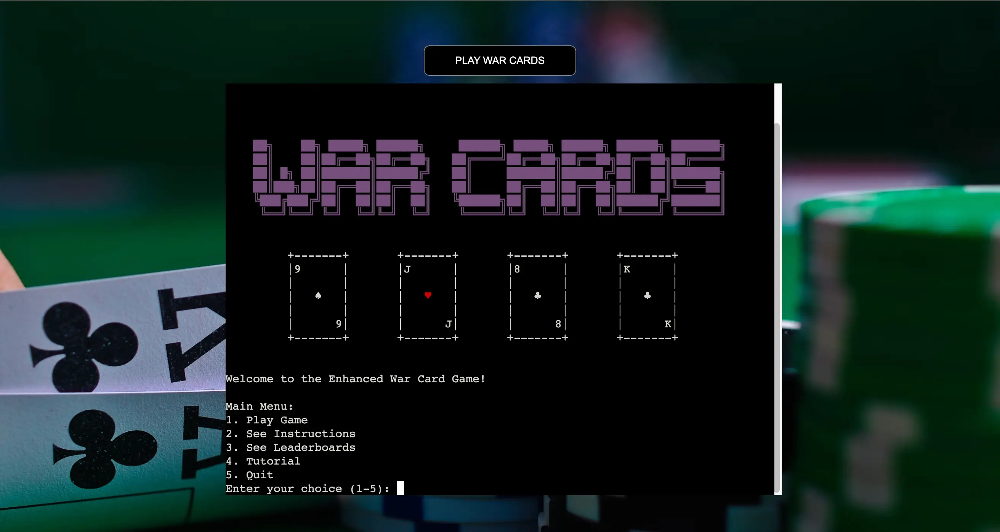

# War Cards

This is a Python implementation of the War cards game with a few additional features. The game runs a webapp terminal and is deployed using Heroku and xterm.js for rendering. This project intends to give users feel of the classic take on the (higher or lower based) War card game experience with a few twists.

#### [Visit War Cards](https://pp3-warcardgame-a42d2255e474.herokuapp.com/)

## User Experience

War Cards is a game that everyone can enjoy. It is a game that can be played by anyone, regardless of age or skill level. The game is easy to learn and can be a great way to pass the time and have some fun.

-   **Great especially for:**

    -   People who enjoy card and simulated risk games.
    -   Casual gamers who enjoy seeing their classical card games in digital form.
    -  People who enjoy competing games for high scores.

### Goals for First-Time Visitors

As a first-time visitor to War cards, I want to:

-   Quickly understand the rules to play the game.
-   Intuitively understand how to navigate the menu and play the game.
-   Enter a new game right away..
-   Get game instructions and rules if necessary.

### Goals for Returning Visitors

As a returning visitor to Minesweeper, I want to:

-   See if my scores are on the leaderboard and how I rank.
-   Play the game again without having to review the tutorial but still have access to it.
- Explore the game's twists and features more thoroughly.

## Features

### Welcome Screen

- **Main Menu**

  -   **Play Game**: Start a new game.
  -   **See Instructions**: View the rules of the game.
  -   **See Leaderboards**: View the top 5 scores.
  -   **Tutorial**: View the tutorial which gives a step-by-step guide on how to play the game.
  -   **Quit**: Exit the game.

  ### Gameplay
  -   **Enter name**: To record the player's name for the leaderboard.
  -   **Number of Rounds Input**: Enter the number of rounds to play (minimum of 4 rounds maximum of 26 rounds.)
  -   **Number of Cards**: Provides user feedback on the number of cards in they have in their deck and the number of cards in the deck of the computer.
  -   **Number of Chips**: Provides user feedback on the number of chips in the player's and computer's chip pots.
  - **Enter your bet**: Provides user with an option of the amount of chips they want to bet.
  -   **Bet input confirmation**: Provides the user with a second chance to confirm the bet amount.
  -   **Quit Option**: Provides the user with the option to quit the game at nearly any point in the game.
  - **Card display**: Provides the user with the card(s) they have drawn and the card(s) the computer has drawn.
  -   **Winner**: Displays the winner of the round.
  -   **Winner of the Game**: Displays the winner of the game.
  -   **Game Over**: Displays the winner of the game and the final score.
  -   **Leaderboard**: Displays the top 5 scores on the boards prior to the game ending so the user can see if they ranked in the top 5.
  - **Return to main menu**: Returns the user to the main menu where they can easily start a new game if they wish to continue playing.

## Deployment

Here’s a guide for manually deploying the project to Heroku using a GitHub repository:

### Deployment Steps:

- **1. Create a Heroku Account**
    - Visit [Heroku](https://dashboard.heroku.com/) and sign up for an account.

- **2. Create a New App**
    - Go to the Heroku dashboard and click **new**.
    - On the dropdown click **Create new app**.
    - Provide a unique app name and select your region then click **Create app**.

- **3. Add Buildpacks**
    - In the **Settings** tab, click **Add buildpack**.
    - Select **Python** and **Node.js** (if needed), ensuring that Python is listed first.

- **4. Connect to GitHub**
    - In the **Deploy** tab, choose **GitHub** as the deployment method.
    - Search for your repository and connect it to Heroku.

- **5. Manual or Automatic Deploy**
    - Enable **Automatic Deploys** for Heroku to update the app with every push to GitHub, or use the **Manual Deploy** option to deploy the main branch manually.

[War Card Game Live Site](https://pp3-warcardgame-a42d2255e474.herokuapp.com/)

- Your code must be placed in the `run.py` file
- Your dependencies must be placed in the `requirements.txt` file

## Creating the Heroku app

When you create the app, you will need to add two buildpacks from the _Settings_ tab. The ordering is as follows:

1. `heroku/python`
2. `heroku/nodejs`

You must then create a _Config Var_ called `PORT`. Set this to `8000`

Connect your GitHub repository and deploy as normal.

## Constraints

The deployment terminal is set to 80 columns by 30 rows. That means that each line of text needs to be 80 characters or less otherwise it will be wrapped onto a second line.

## Credits
  I would like to credit the following resources for their help in the creation of this project:
  - [W3Schools](https://www.w3schools.com/)
  - [Stack Overflow](https://stackoverflow.com/)
  - [Code Institute](https://codeinstitute.net/) Love Sandwiches in Particular

  ## Acknowledgements
  I would like to thank Daisy Mc Girr for her moral support and generous advice throughout the course.

